# Common Mermaid Diagram Patterns

Practical examples organized by use case. Copy and adapt these patterns for your documentation.

---

## API Request Flow

**Use case:** Documenting how requests flow through your system

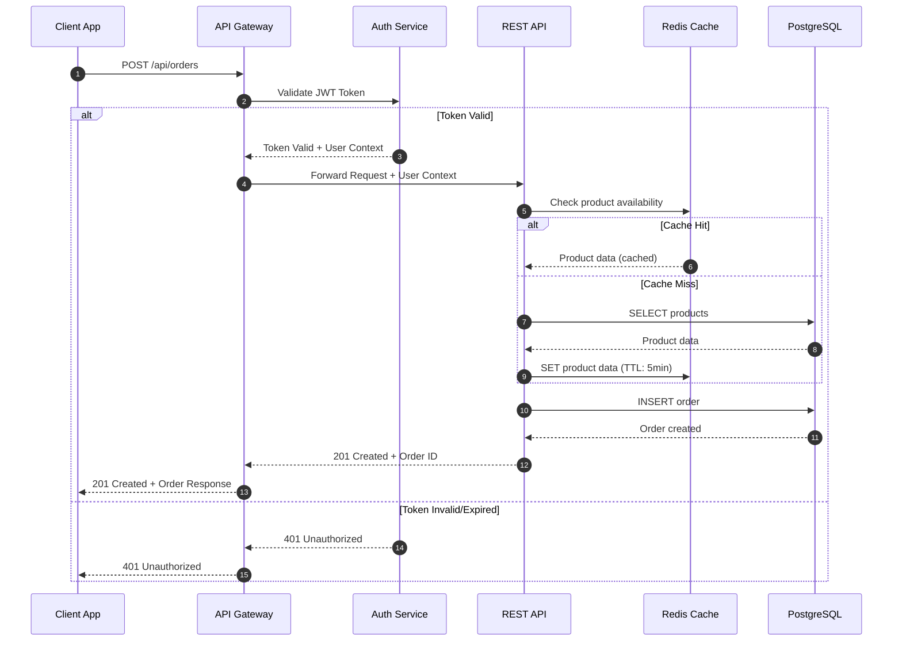

---

## System Architecture Overview

**Use case:** High-level architecture for README or onboarding

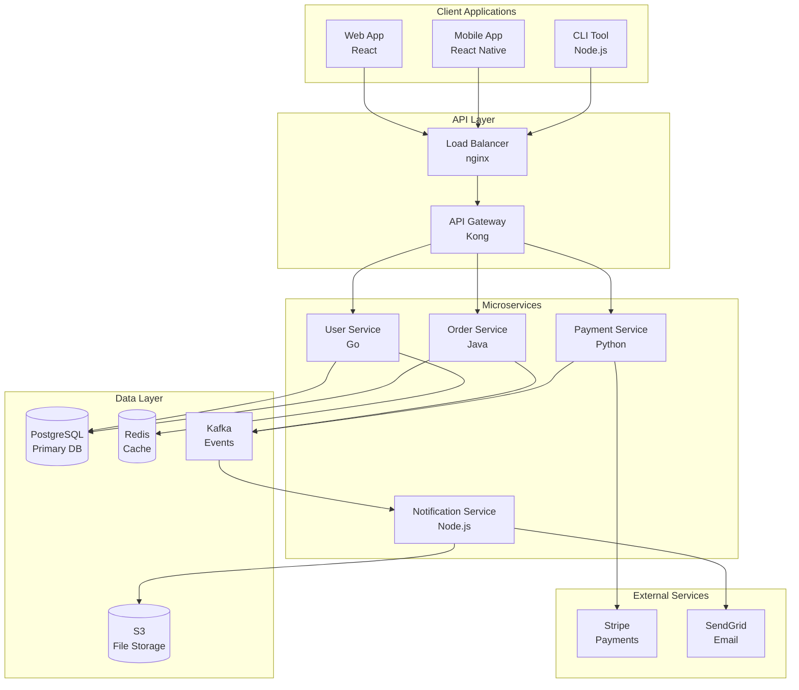

---

## Database Schema

**Use case:** Documenting database relationships

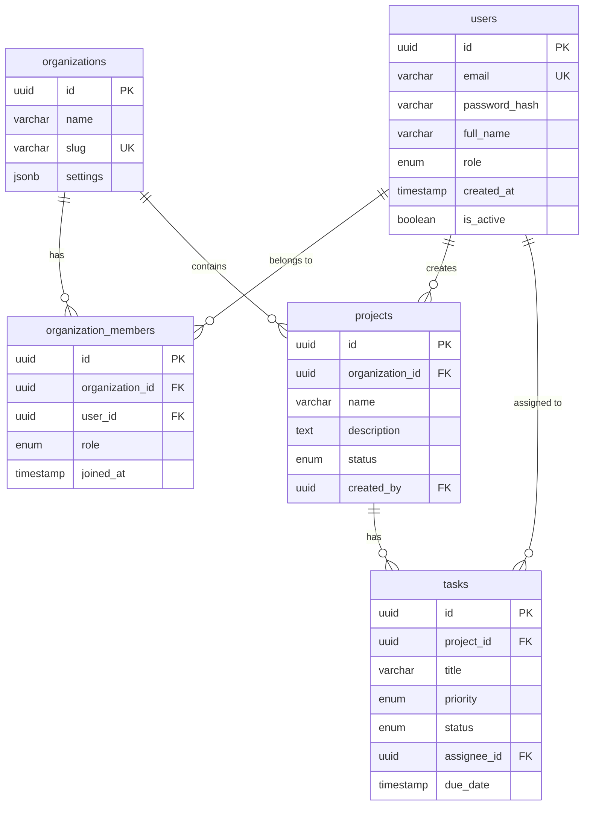

---

## Order State Machine

**Use case:** Documenting lifecycle states

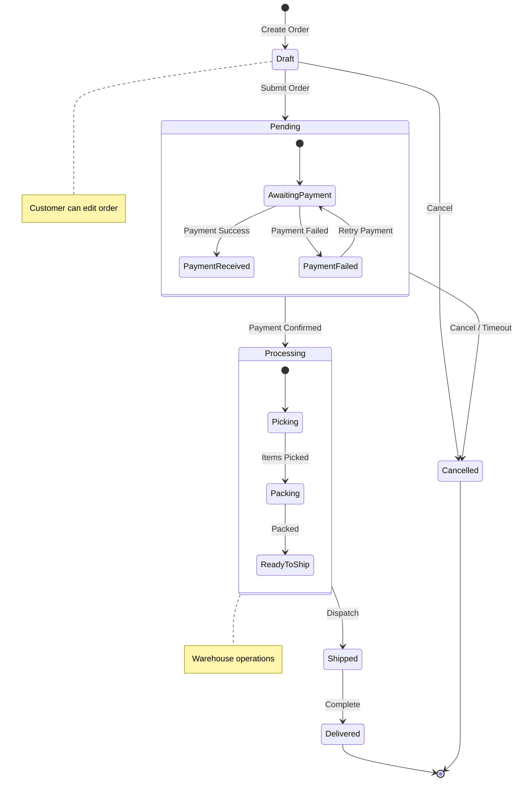

---

## Authentication Flow (OAuth2/PKCE)

**Use case:** Documenting OAuth2 authentication

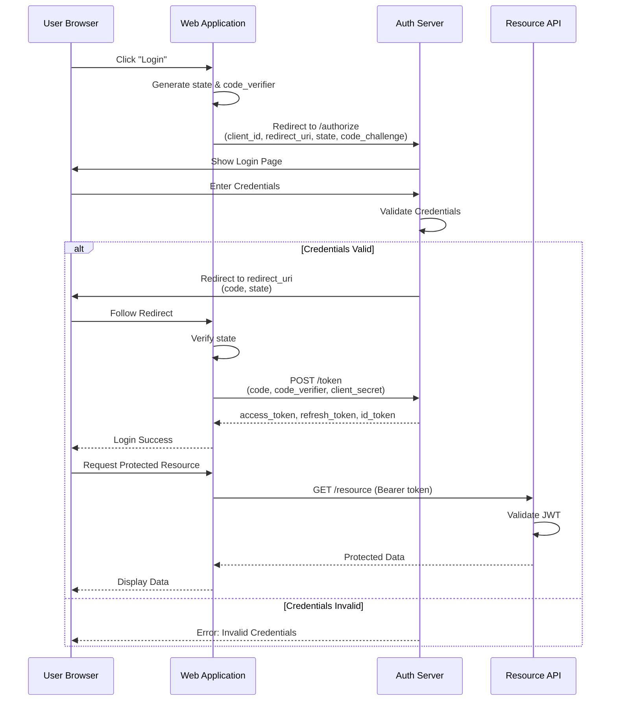

---

## CI/CD Pipeline

**Use case:** Documenting deployment pipeline

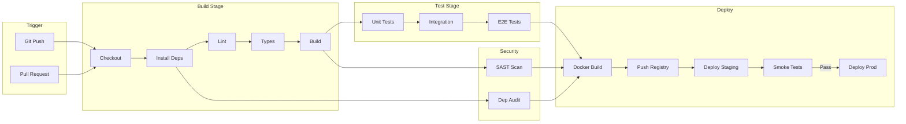

---

## Domain Model (Class Diagram)

**Use case:** Documenting entity relationships in code

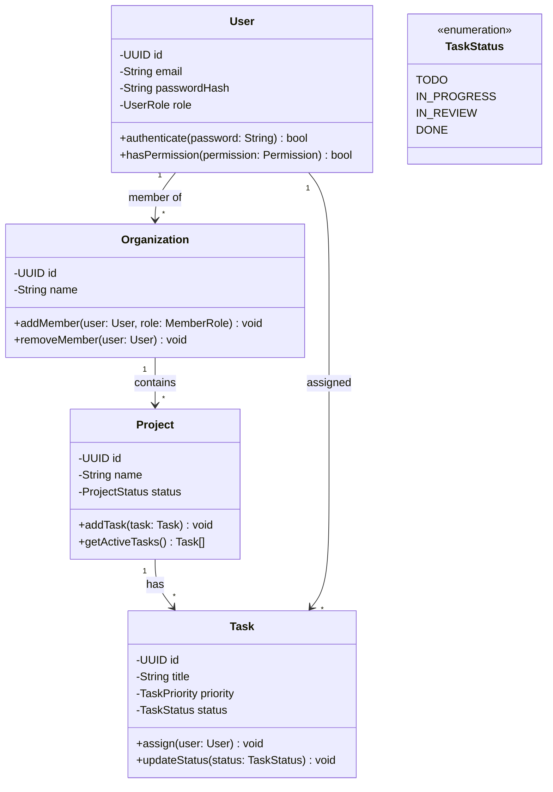

---

## Microservices Communication Patterns

**Use case:** Documenting service-to-service patterns

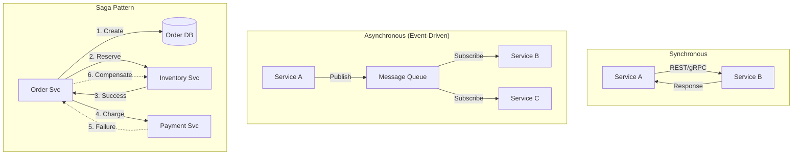

---

## Error Handling Flow

**Use case:** Documenting error classification and handling

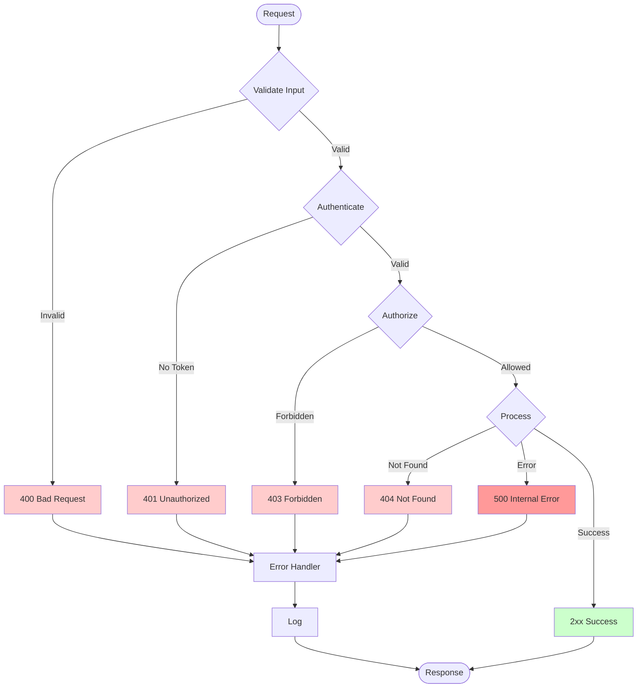

---

## Component Hierarchy (Frontend)

**Use case:** Documenting React/Vue component structure

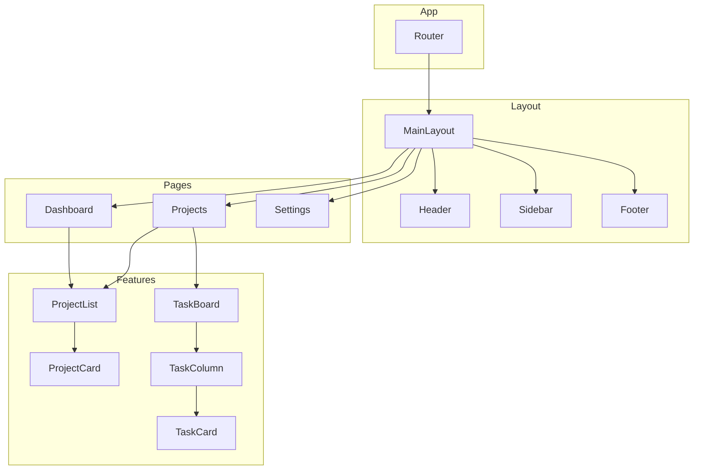

---

## User Journey

**Use case:** Documenting user experience

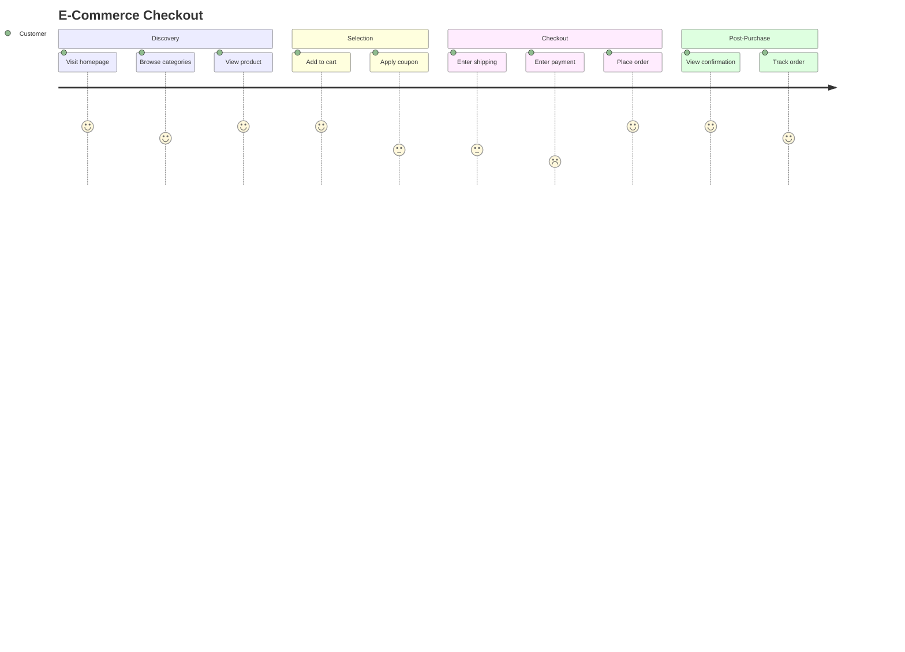

---

## Git Branching Strategy

**Use case:** Documenting team Git workflow

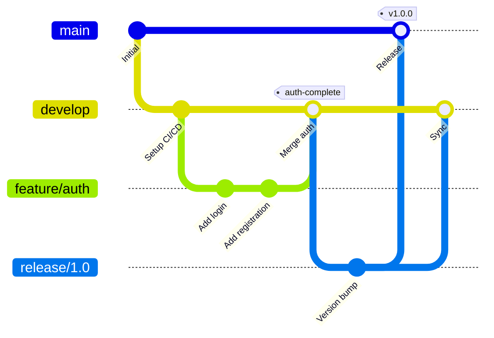

---

## Feature Prioritization

**Use case:** Documenting priority decisions

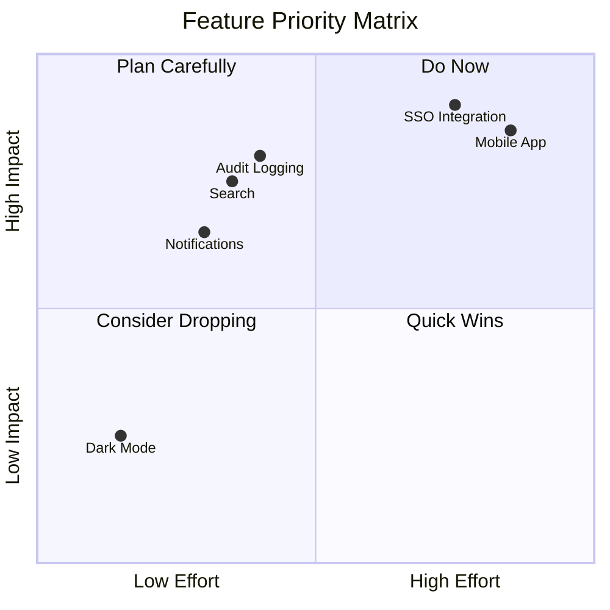

---

## Architecture Decision Mindmap

**Use case:** Documenting ADRs

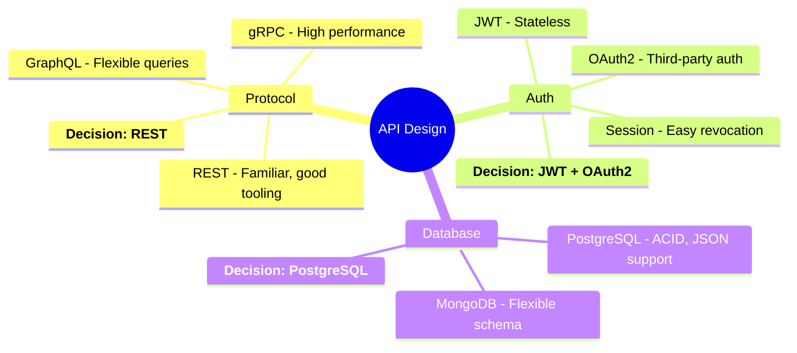

---

*These patterns are part of the docs-with-mermaid skill. Mix and match to create comprehensive documentation.*
