# Mermaid Diagram Complete Syntax Reference

Mermaid is a text-based diagramming tool that renders from markdown-like syntax. It integrates natively with GitHub, GitLab, Notion, Obsidian, and most modern documentation platforms.

Every Mermaid diagram starts with a diagram type declaration inside a fenced code block with `mermaid` language.

---

## Flowcharts

Visualize processes, workflows, decision trees, and algorithms.

### Declaration and Direction

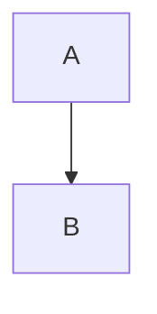

**Direction Options:**
- `TD` or `TB` - Top to Bottom
- `BT` - Bottom to Top
- `LR` - Left to Right
- `RL` - Right to Left

### Node Shapes

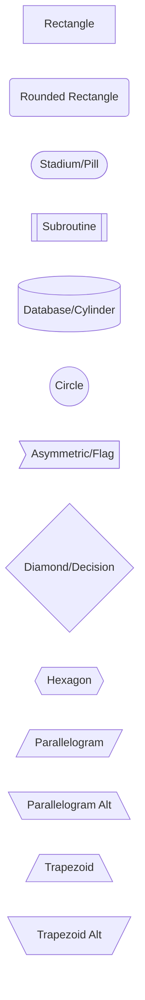

### Arrow/Edge Types

```mermaid
flowchart LR
    A --> B           %% Arrow
    B --- C           %% Line (no arrow)
    C -.-> D          %% Dotted arrow
    D ==> E           %% Thick arrow
    E --text--> F     %% Arrow with text
    F -->|text| G     %% Alternative text syntax
    G -.text.-> H     %% Dotted with text
    H ==text==> I     %% Thick with text
    I <--> J          %% Bidirectional
    J o--o K          %% Circle endpoints
    K x--x L          %% Cross endpoints
```

### Subgraphs

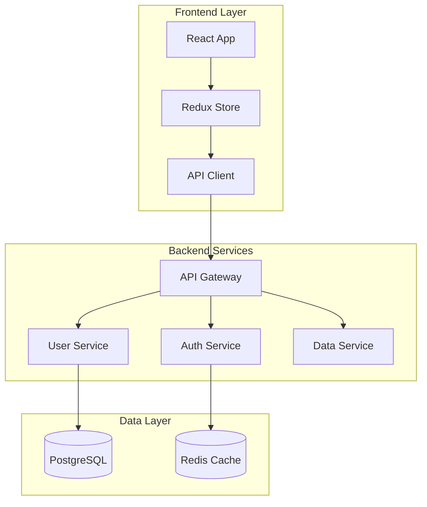

### Styling

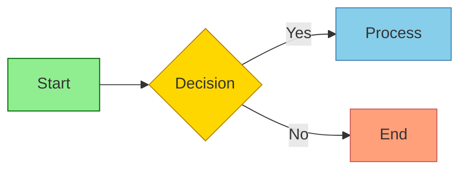

---

## Sequence Diagrams

Show interactions between components/actors over time.

### Basic Syntax

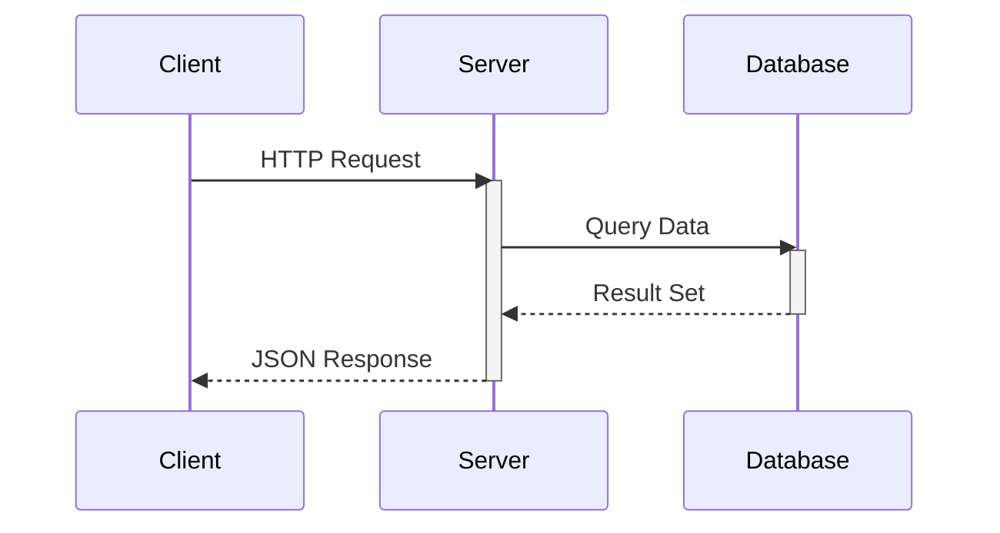

### Message Types

```
A->>B     Solid line with arrowhead
A-->>B    Dotted line with arrowhead
A-)B      Solid line with open arrow
A--)B     Dotted line with open arrow
A-xB      Solid line with cross (async)
A--xB     Dotted line with cross
```

### Control Flow

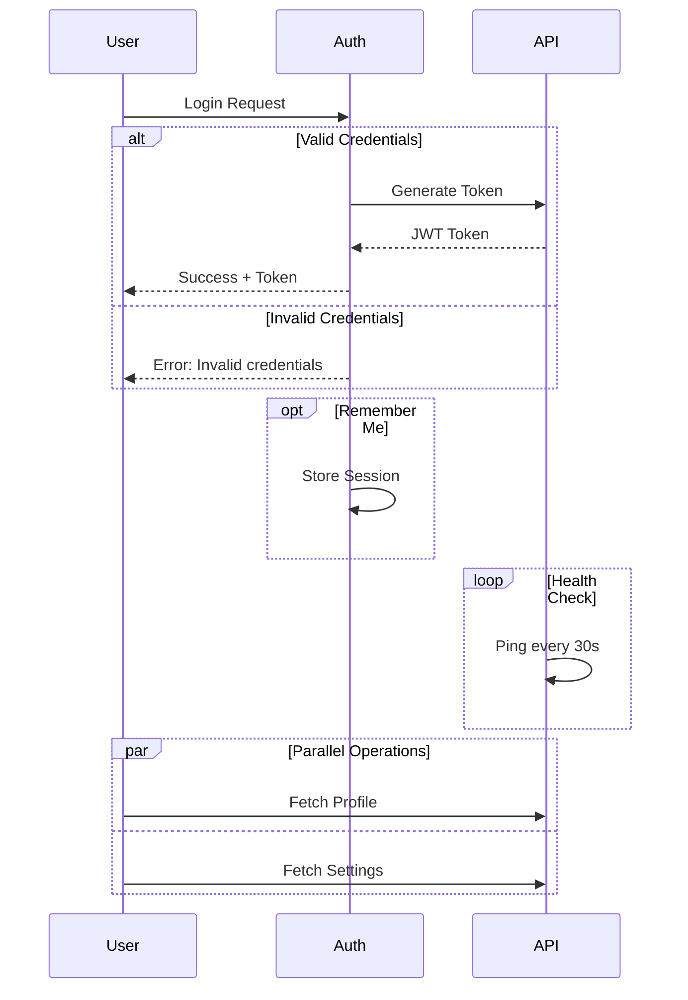

### Notes and Activation

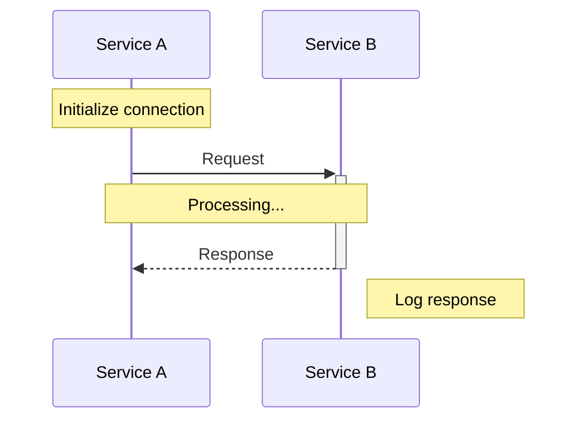

### Auto-numbering

Add `autonumber` after `sequenceDiagram` to auto-number messages.

---

## Class Diagrams

Show object-oriented structure with classes, attributes, methods, and relationships.

### Class Definition

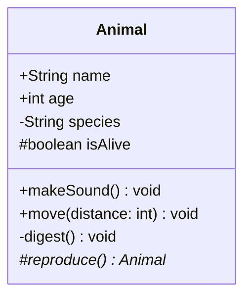

**Visibility:** `+` Public, `-` Private, `#` Protected, `~` Package/Internal
**Classifiers:** `*` Abstract, `$` Static

### Relationships

```
Animal <|-- Dog           %% Inheritance (is-a)
Flyable <|.. Bird         %% Implementation (implements)
Car *-- Engine            %% Composition (lifecycle dependent)
University o-- Student    %% Aggregation (independent lifecycle)
Teacher --> Student       %% Association (uses)
Client ..> Service        %% Dependency (depends on)
```

### Cardinality

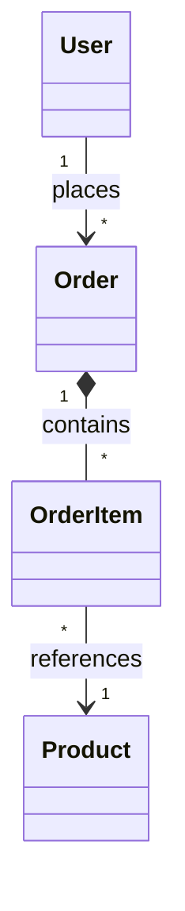

---

## State Diagrams

Model state machines and transitions.

### Basic States

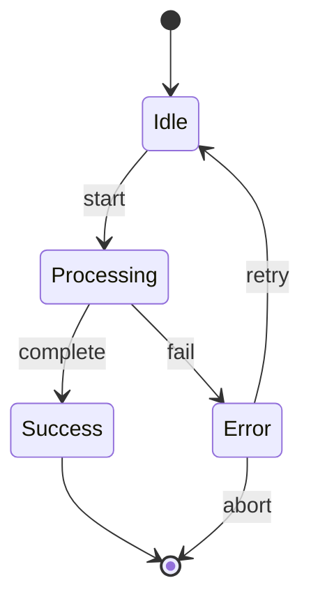

### Composite States

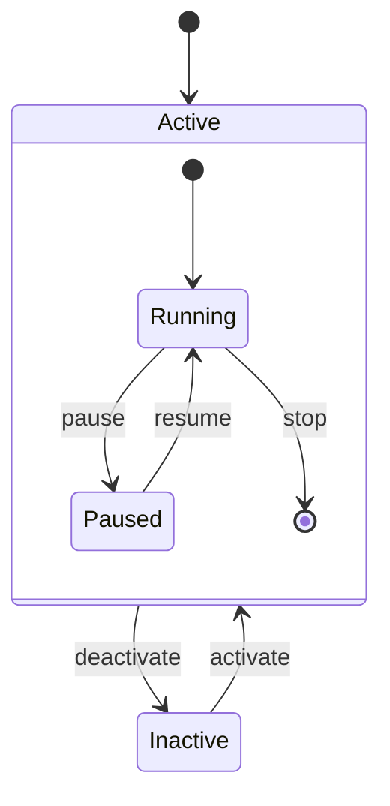

### Choice Points and Forks

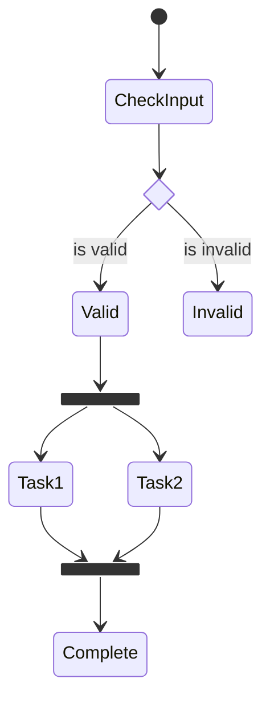

---

## Entity Relationship Diagrams

Model database schemas and entity relationships.

### Basic Syntax

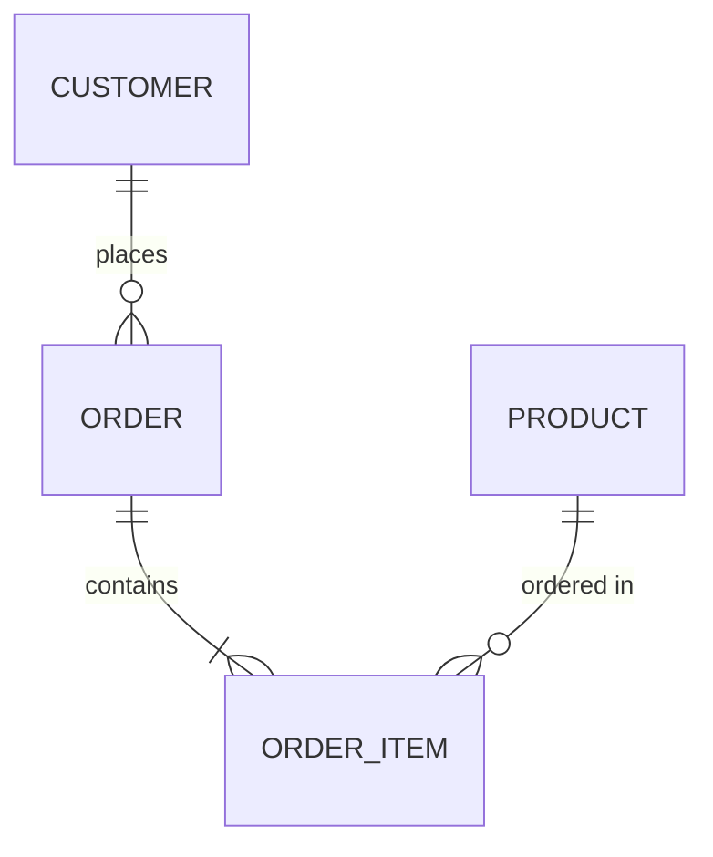

### Cardinality (Crow's Foot)

```
||--||  One-to-One (exactly one)
||--o|  One-to-Zero-or-One
||--|{  One-to-One-or-More
||--o{  One-to-Zero-or-More
}|--|{  One-or-More to One-or-More
}o--o{  Zero-or-More to Zero-or-More
```

**Symbols:** `|` Exactly one, `o` Zero or one, `{` One or more, `}` Zero or more

### Entities with Attributes

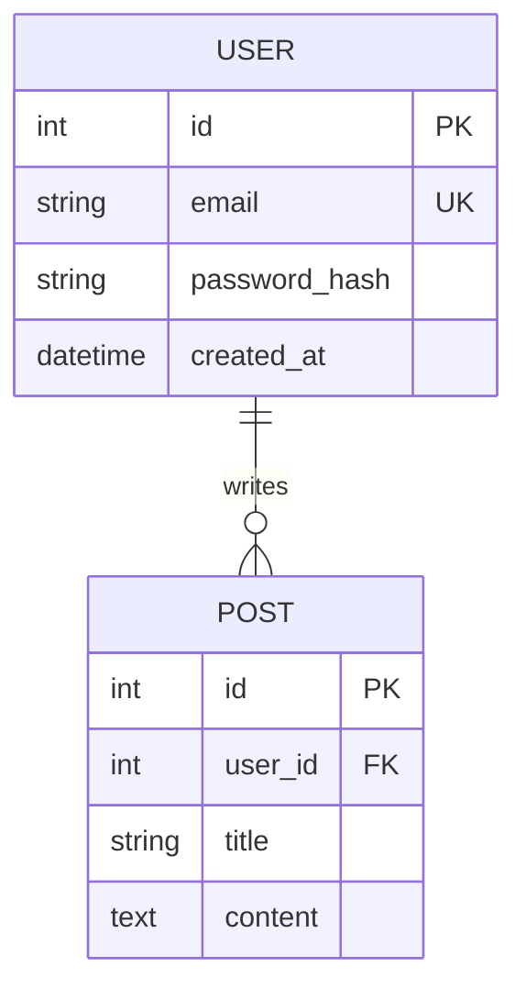

**Attribute Keys:** `PK` Primary Key, `FK` Foreign Key, `UK` Unique Key

### Identifying vs Non-Identifying

```
ORDER ||--|{ ORDER_LINE : contains     %% Identifying (solid) - child needs parent
PERSON }|..|{ CAR : drives            %% Non-identifying (dashed) - independent
```

---

## C4 Architecture Diagrams

Model software architecture at different abstraction levels.

### System Context (C4Context)

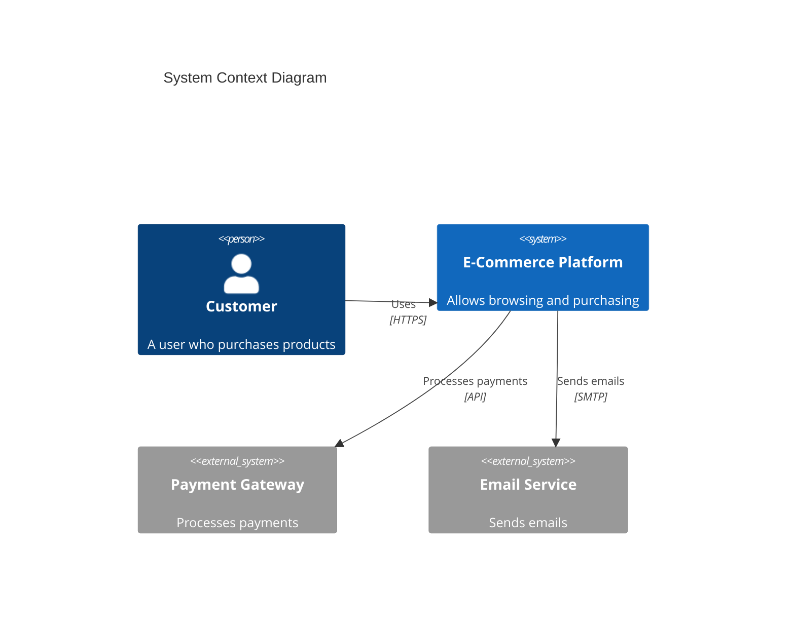

### Container Diagram (C4Container)

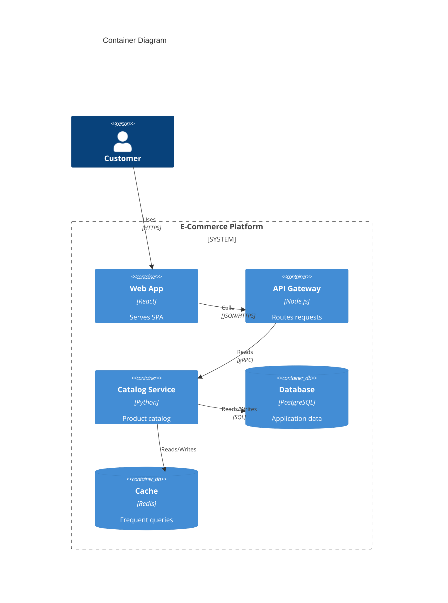

### Component Diagram (C4Component)

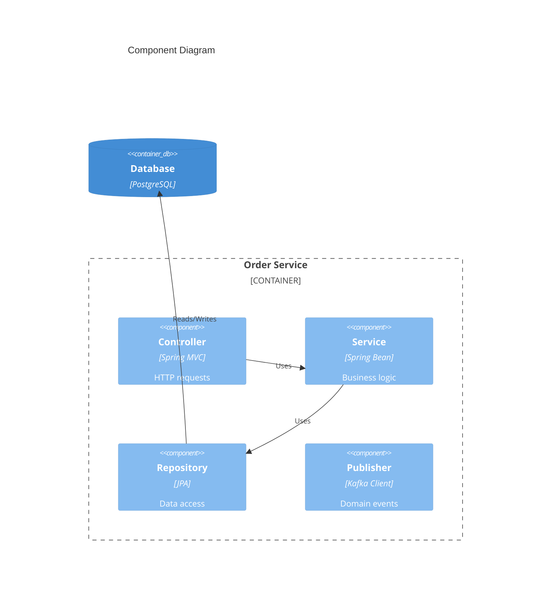

---

## User Journey Maps

Visualize user experiences across touchpoints.

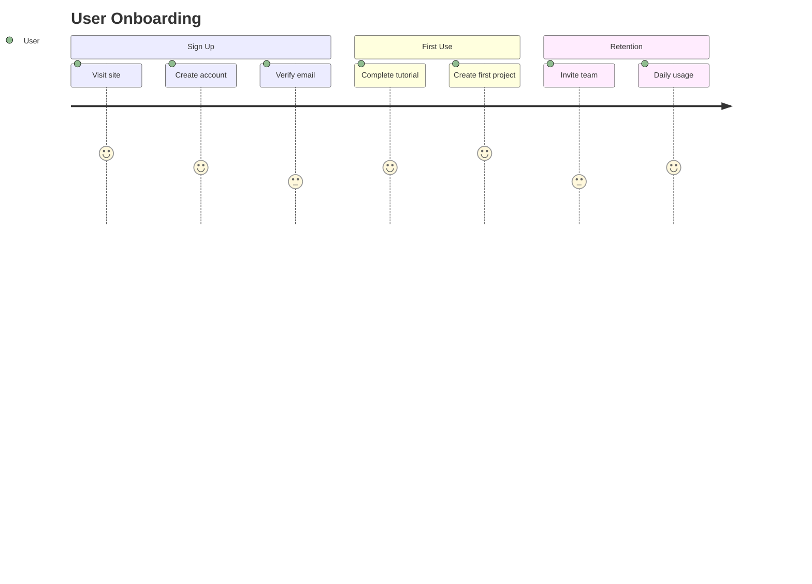

**Score Scale:** 1 (worst) to 5 (best)

---

## Gantt Charts

Project schedules and timelines.

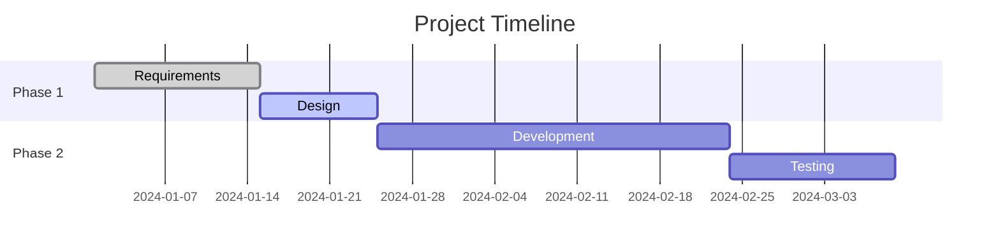

**Task markers:** `done`, `active`, `crit` (critical), `milestone`

---

## Other Diagram Types

### Pie Charts

```mermaid
pie showData
    title Distribution
    "Category A" : 35
    "Category B" : 25
    "Category C" : 20
    "Other" : 20
```

### Mindmaps

```mermaid
mindmap
    root((Topic))
        Branch A
            Leaf 1
            Leaf 2
        Branch B
            Leaf 3
```

### Timeline

```mermaid
timeline
    title Milestones
    section Q1
        January : Kickoff
        March : MVP
    section Q2
        June : Launch
```

### Git Graphs

```mermaid
gitGraph
    commit id: "Initial"
    branch develop
    commit id: "Feature"
    checkout main
    merge develop id: "Release" tag: "v1.0"
```

### Quadrant Charts

```mermaid
quadrantChart
    title Priority Matrix
    x-axis Low Effort --> High Effort
    y-axis Low Impact --> High Impact
    quadrant-1 Do First
    quadrant-2 Plan
    quadrant-3 Drop
    quadrant-4 Quick Wins
    Feature A: [0.3, 0.8]
    Feature B: [0.7, 0.9]
```

### Block Diagrams

```mermaid
block-beta
    columns 3
    A["Frontend"]:1 B["API"]:1 C["Services"]:1
    D[("Database")]:1 E[("Cache")]:1 F[("Queue")]:1
    A --> B
    B --> C
    C --> D
```

---

## Troubleshooting

- **Reserved words:** Avoid `end` as node ID in lowercase. Use `End` or wrap in quotes.
- **Special characters:** Wrap text with parentheses/brackets in quotes: `A["Node with (parens)"]`
- **Long labels:** Use markdown strings: `` A["`**Bold** text`"] ``

*This reference is part of the docs-with-mermaid skill.*
