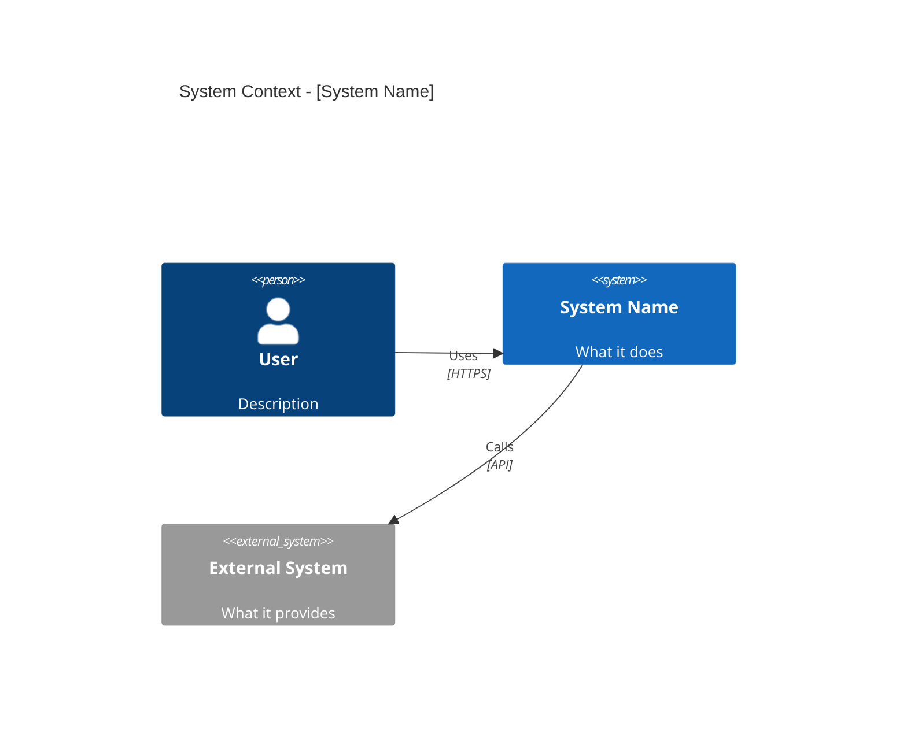
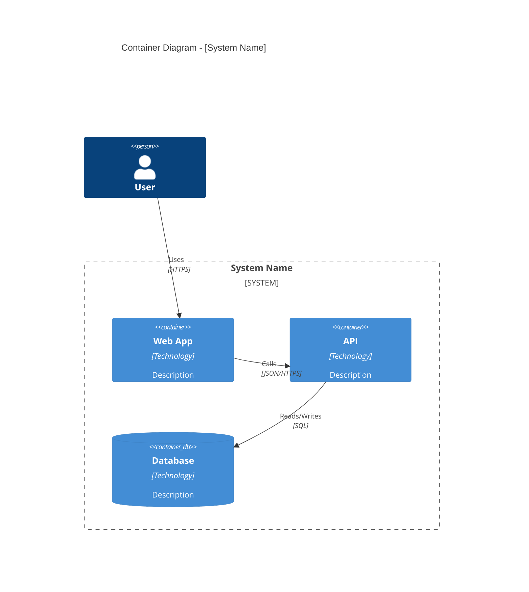
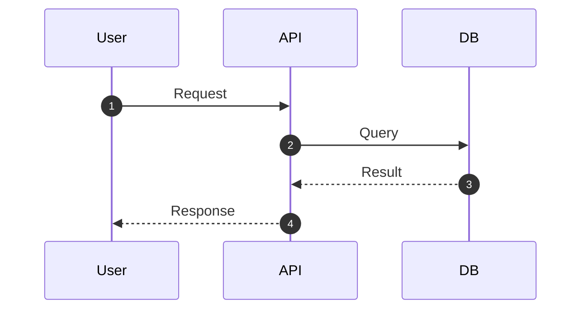
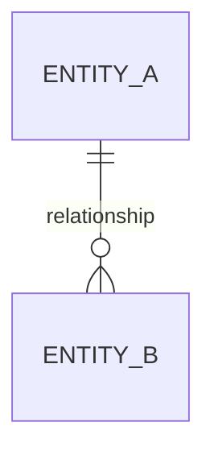

# [System Name] Architecture

## System Context

[What is this system? Who uses it? What external systems does it interact with?]

## Container Architecture

[What applications and data stores make up the system?]

## Key Flows

### [Primary Flow Name]

[Explain the most important flow through the system]

## Data Model

[If applicable]

## Design Decisions

| Decision | Rationale |
|----------|-----------|
| [Choice made] | [Why this choice] |

## Deployment

[How the system is deployed, if relevant]
