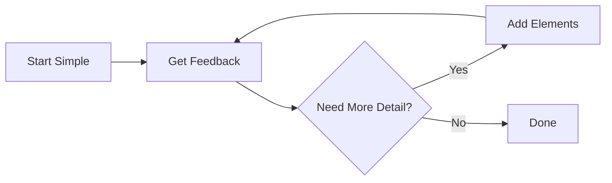
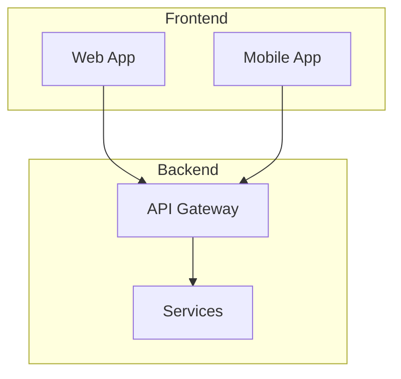
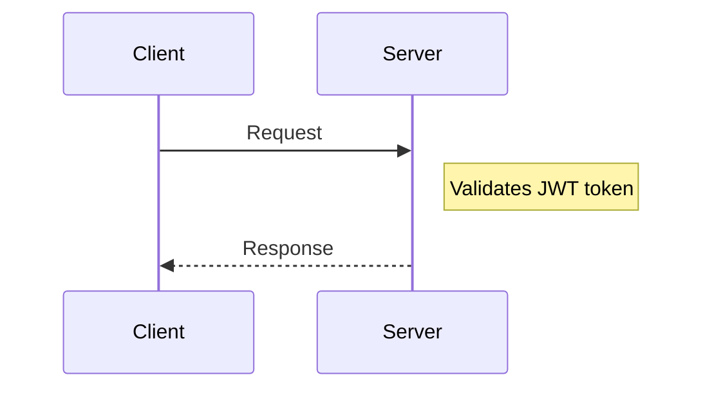
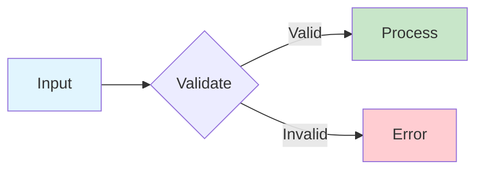

# Diagram Best Practices

## Creation Guidelines

### Start Simple, Add Complexity Gradually

### Use Consistent Naming

- `PascalCase` for services/components: `UserService`, `OrderAPI`
- `camelCase` for actions/methods: `processOrder`, `validateUser`
- `SCREAMING_SNAKE` for constants/configs: `MAX_RETRIES`, `API_TIMEOUT`
- Keep labels concise but descriptive

### Group Related Elements

Use subgraphs in flowcharts to group related components:

### Show Direction of Flow

- `LR` (left-to-right) for timelines and sequential processes
- `TB` (top-to-bottom) for hierarchies and architectures
- `BT` (bottom-to-top) for dependency trees
- Arrows should indicate data/control flow direction

### Add Context with Notes

In sequence diagrams, use notes to explain non-obvious behavior:

### Use Color Purposefully

Apply color to highlight:
- Different system boundaries (internal vs external)
- Status (success/error/warning paths)
- Priority or criticality levels

## Common Mistakes to Avoid

- **Overcrowded diagrams** - split into multiple focused diagrams
- **Missing labels** on arrows/relationships
- **Color-only differentiation** - add text labels too for accessibility
- **Diagrams without context** - always add explanatory prose
- **Using `end` as a node ID** - it's a reserved word; use `End` or `END`
- **Unescaped special characters** - wrap text with parentheses/brackets in quotes

## Platform-Specific Notes

- **GitHub/GitLab**: Native rendering in markdown files and comments
- **Notion**: Use code blocks with `mermaid` language
- **VS Code**: Markdown Preview Enhanced extension
- **Obsidian**: Native support
