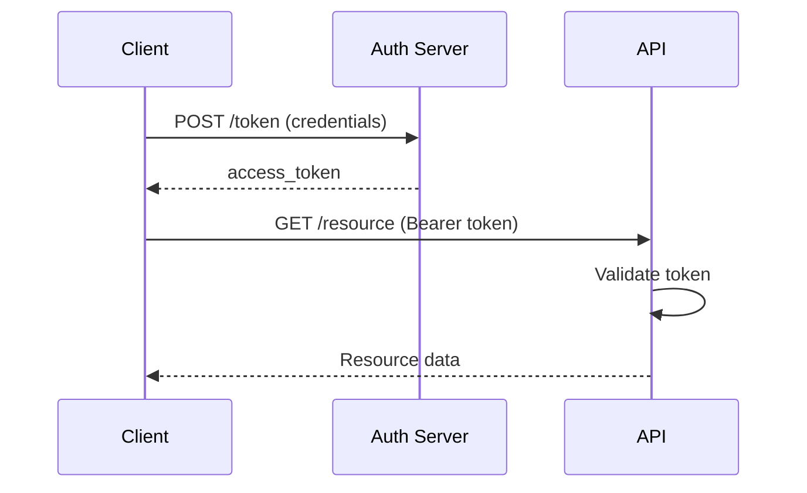
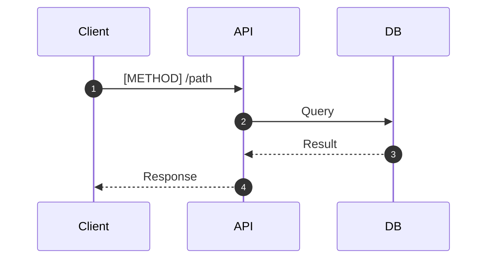
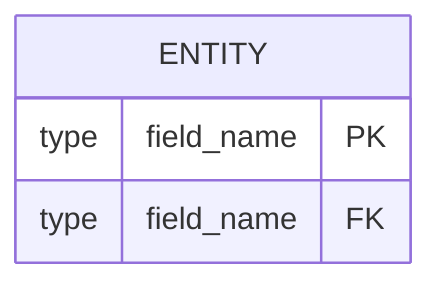

# [API Name] Documentation

## Overview

[What does this API do? Who consumes it?]

## Authentication

[How to authenticate with the API]



## Endpoints

### [METHOD] /path

**Description:** [What this endpoint does]

**Request:**
```json
{
  "field": "value"
}
```

**Response:**
```json
{
  "field": "value"
}
```

**Flow:**



## Data Model



## Error Responses

| Status | Code | Description |
|--------|------|-------------|
| 400 | VALIDATION_ERROR | Invalid input |
| 401 | UNAUTHORIZED | Missing/invalid token |
| 403 | FORBIDDEN | Insufficient permissions |
| 404 | NOT_FOUND | Resource not found |
| 500 | INTERNAL_ERROR | Server error |
