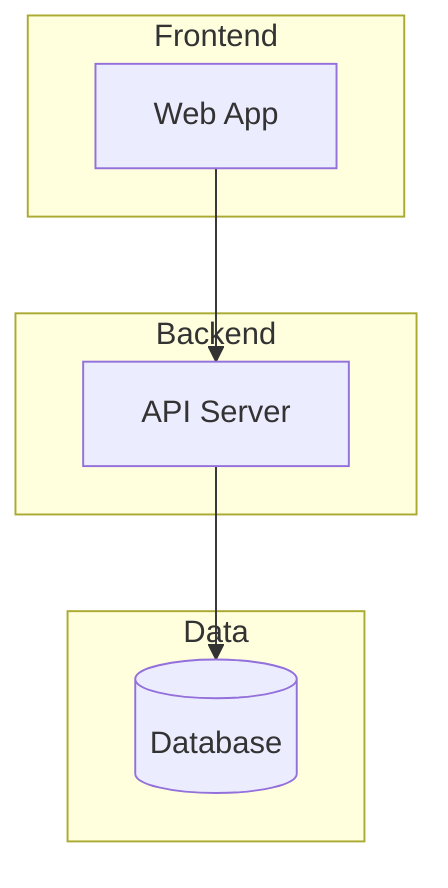
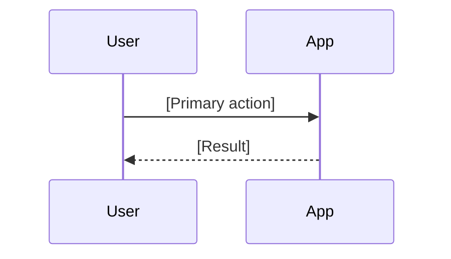

# [Project Name]

[One-line description of what this project does]

## Architecture

[Brief description of how it's built]



## Getting Started

### Prerequisites

- [Requirement 1]
- [Requirement 2]

### Installation

```bash
# Clone and install
git clone [repo-url]
cd [project-name]
npm install
```

### Running

```bash
npm run dev
```

## Usage

[Key workflow or primary use case]



## Project Structure

```
project/
├── src/
│   ├── components/
│   ├── services/
│   └── utils/
├── tests/
└── docs/
```

## Contributing

[How to contribute]

## License

[License type]
